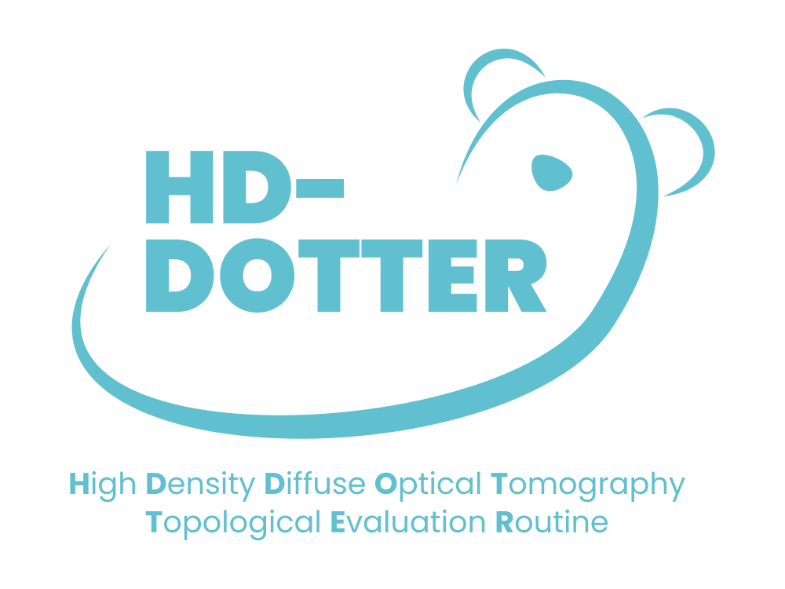

# HDDOTTER
HD-DOT imaging pipeline for Matlab and Python (heavily under construction atm). 🦦

Very rough outline:
1. Convert Gowerlab's LUMO output into a friendly .snirf format using the Lumomat toolbox in Matlab.
2. Add your own layout coordinates (sensors, emitters, anatomical landmarks) possibly also using Lumomat...or in Python (Currently this is a huge question mark). 
3. Get your segmented anatomical tissue images.

4. Mix steps 1-2-3 in Python using the MNE toolbox.
5. Preprocess your data. (Partially done. Partially I know what to do.)
6a. Do stats as you wish.
6b. Convert everything to fMRI-compatible format.
7. Do stats as you wish.
8. Adobt a dog.
